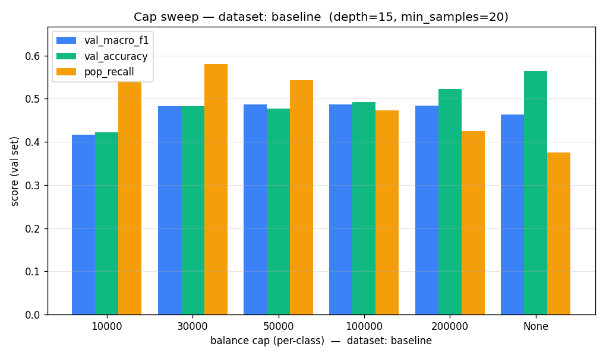
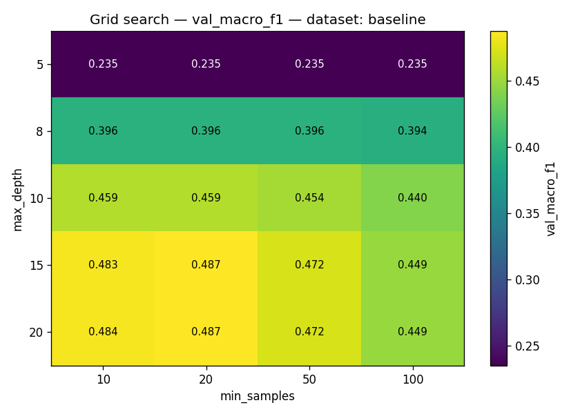
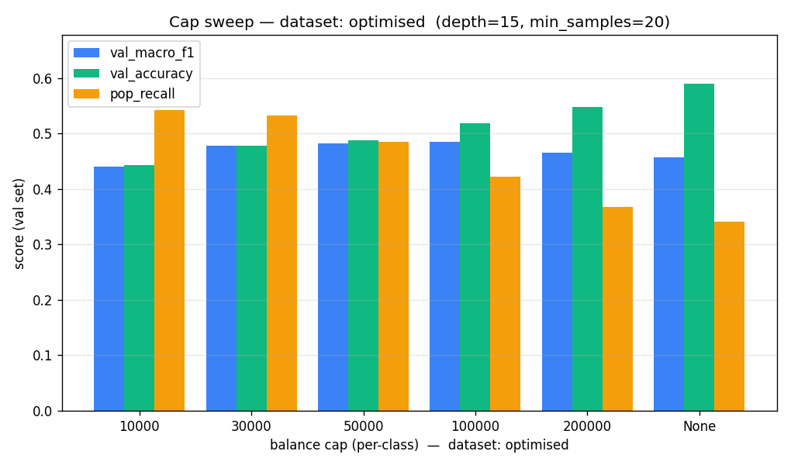
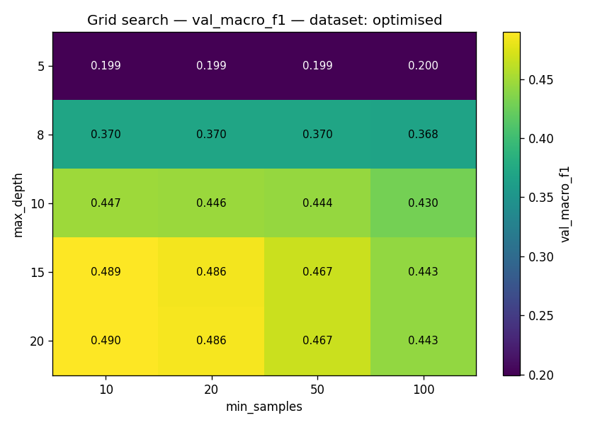

# ID3 Sweep — Methodological Validation Report

**Date:** 2026-05-17 · **Branch:** main · **Author:** Claude (Opus 4.7, 1M ctx)
**Generated by:** `scripts/sweep_id3.py` (one-shot CLI, seed=42, workers via `--workers`)

**Wallclock:** 4790.3s total. Per-stage wallclock: stage1_prep=60.8s, stage2_suba=1873.1s, stage4_subb=1393.9s, stage6_cross=1453.3s.

This report is the **primary deliverable** of Prompt D1. The CSV/PNG artefacts under `data/sweeps/sweep_*.{csv,png}` are raw evidence; the methodological recommendation in §5 and the audit smells in §7 are the load-bearing parts.

## 1. Methodology

### What was tested

Two datasets — **baseline** (`data/popout_200k.csv`, 5k MCTS iters, c=√2, k=1, UCB1) and **optimised** (`data/popout_dataset_150k.csv`, 20k MCTS iters, c=2, k=1, UCB1) — same schema (42 cells + `move_count` + `current_player` + `own_pieces_bottom_row` + `opp_pieces_bottom_row` + `class`).

For **each** dataset:

- **Sub-experiment A — cap sweep.** `cap ∈ {10000, 30000, 50000, 100000, 200000, None}` at fixed `(max_depth=15, min_samples=20)`. 6 trees.
- **Sub-experiment B — grid search at the dataset's best cap.** `max_depth ∈ {5, 8, 10, 15, 20}` × `min_samples ∈ {10, 20, 50, 100}` = 20 trees.

Plus a **cross-dataset transferability** pass: apply each dataset's best `(cap*, depth*, min_samples*)` recipe to the other dataset and re-evaluate. Two extra trees.

### Fixed pipeline parameters

- `seed = 42` (controls balance sampling, stratified split, all permutations).
- **Split:** stratified 72/8/20 train/val/test (via `stratified_split` in `ai/dt_pipeline.py` — nested: first 80% train+val + 20% test, then 90/10 of the 80% train+val gives the final 72/8/20 of the original).
- **Bins:** the hand-designed `POPOUT_BIN_DEFINITIONS` constants for `move_count`, `own_pieces_bottom_row`, `opp_pieces_bottom_row`. Identical across all 52 trees.
- **Features included:** all 46 — `current_player` is kept in (see §7 for why this is worth a follow-up).
- **Test set is reserved.** No test-set evaluation in this sweep; selection is on val only. Phase 2 will use the test set for the final head-to-head.

### Why val (not CV) for selection

The dataset is large enough that a single stratified 10% val slice (≈ 5k–150k rows depending on cap) is a low-variance estimate. K-fold would multiply the sweep wallclock by k× without changing the relative ranking we use to pick `(cap*, depth*, min_samples*)`. K-fold is explicitly the final-evaluation phase's job, applied to the final two trees only.

### Metric choice

**Selection metric: `val_macro_f1`** — the dataset is imbalanced (drop_3 dominates even after capping; POP classes are 7× rarer than the average DROP). Accuracy rewards predicting the majority class; macro-F1 forces the imbalance to be visible by weighting every class equally. Tie-break: smaller `n_nodes` (Occam).

Also reported and tracked for sanity: `val_accuracy`, `pop_recall` (mean recall over classes 7–13), `n_nodes`, `n_leaves`, `train_time_s`, `train_size`.

## 2. Dataset **baseline** (`data/popout_200k.csv`)

### Sub-A — cap sweep (depth=15, min_samples=20)

| cap | train_size | val_size | val_macro_f1 | val_accuracy | pop_recall | n_nodes | n_leaves | train_time_s |
|---:|---:|---:|---:|---:|---:|---:|---:|---:|
| `10000` | 100,348 | 11,149 | **0.4172** | 0.4218 | 0.5417 | 15,834 | 10,249 | 198.0 |
| `30000` | 254,928 | 28,323 | **0.4827** | 0.4820 | 0.5800 | 39,704 | 25,530 | 386.1 |
| `50000` | 356,994 | 39,663 | **0.4871** | 0.4773 | 0.5435 | 55,834 | 35,777 | 617.7 |
| `100000` | 596,804 | 66,308 | **0.4871** | 0.4927 | 0.4734 | 91,996 | 58,646 | 1069.2 |
| `200000` | 956,804 | 106,308 | **0.4838** | 0.5218 | 0.4254 | 144,827 | 91,893 | 1384.5 |
| `None` | 1,379,168 | 153,235 | **0.4635** | 0.5639 | 0.3753 | 197,659 | 124,926 | 1868.9 |

**Sub-A best:** `cap=50000` — val_macro_f1 = 0.4871, val_accuracy = 47.73%, pop_recall = 0.5435, n_nodes = 55,834.

### Sub-B — grid search at `cap=50000`

Heatmap (rows = `max_depth`, cols = `min_samples`, cell value = `val_macro_f1`):

| max_depth ↓ \ min_samples → | 10 | 20 | 50 | 100 |
|---:|---:|---:|---:|---:|
| **5** | 0.2349 | 0.2349 | 0.2350 | 0.2350 |
| **8** | 0.3958 | 0.3959 | 0.3958 | 0.3942 |
| **10** | 0.4585 | 0.4586 | 0.4535 | 0.4404 |
| **15** | 0.4835 | 0.4871 | 0.4722 | 0.4485 |
| **20** | 0.4841 | 0.4873 | 0.4722 | 0.4485 |

**Sub-B best:** `(cap=50000, max_depth=20, min_samples=20)` — val_macro_f1 = 0.4873, val_accuracy = 47.75%, pop_recall = 0.5436, n_nodes = 57,379, train_time = 523.1s.

## 3. Dataset **optimised** (`data/popout_dataset_150k.csv`)

### Sub-A — cap sweep (depth=15, min_samples=20)

| cap | train_size | val_size | val_macro_f1 | val_accuracy | pop_recall | n_nodes | n_leaves | train_time_s |
|---:|---:|---:|---:|---:|---:|---:|---:|---:|
| `10000` | 97,833 | 10,869 | **0.4396** | 0.4427 | 0.5424 | 15,333 | 9,949 | 192.6 |
| `30000` | 233,473 | 25,937 | **0.4775** | 0.4773 | 0.5318 | 36,180 | 23,357 | 358.2 |
| `50000` | 334,273 | 37,137 | **0.4826** | 0.4874 | 0.4845 | 51,817 | 33,292 | 559.4 |
| `100000` | 546,839 | 60,755 | **0.4855** | 0.5189 | 0.4226 | 83,367 | 53,289 | 1018.7 |
| `200000` | 837,256 | 93,023 | **0.4649** | 0.5484 | 0.3671 | 123,629 | 78,512 | 1261.6 |
| `None` | 1,054,574 | 117,168 | **0.4569** | 0.5896 | 0.3405 | 148,079 | 94,014 | 1417.0 |

**Sub-A best:** `cap=100000` — val_macro_f1 = 0.4855, val_accuracy = 51.89%, pop_recall = 0.4226, n_nodes = 83,367.

### Sub-B — grid search at `cap=100000`

Heatmap (rows = `max_depth`, cols = `min_samples`, cell value = `val_macro_f1`):

| max_depth ↓ \ min_samples → | 10 | 20 | 50 | 100 |
|---:|---:|---:|---:|---:|
| **5** | 0.1993 | 0.1993 | 0.1993 | 0.1996 |
| **8** | 0.3702 | 0.3701 | 0.3705 | 0.3684 |
| **10** | 0.4475 | 0.4465 | 0.4436 | 0.4298 |
| **15** | 0.4894 | 0.4855 | 0.4672 | 0.4425 |
| **20** | 0.4901 | 0.4856 | 0.4672 | 0.4425 |

**Sub-B best:** `(cap=100000, max_depth=20, min_samples=10)` — val_macro_f1 = 0.4901, val_accuracy = 52.38%, pop_recall = 0.4358, n_nodes = 161,732, train_time = 1280.0s.

## 4. Cross-dataset transferability check

Apply each dataset's best recipe `(cap*, depth*, min_samples*)` to the OTHER dataset; evaluate on that dataset's val set. The gap below is what decides Outcome X (transfer well, shared recipe) vs Outcome Y (don't transfer, per-dataset recipes).

| applied recipe | trained on | val set | val_macro_f1 | val_accuracy | pop_recall | n_nodes |
|---|---|---|---:|---:|---:|---:|
| recipe[baseline] (own best) | baseline | baseline | **0.4873** | 0.4775 | 0.5436 | 57,379 |
| recipe[optimised] (own best) | optimised | optimised | **0.4901** | 0.5238 | 0.4358 | 161,732 |
| recipe[baseline] applied to optimised | optimised | optimised | 0.4826 | 0.4875 | 0.4846 | 53,018 |
| recipe[optimised] applied to baseline | baseline | baseline | 0.4907 | 0.4934 | 0.4863 | 181,171 |

### Gap (foreign recipe vs own best)

| target dataset | own best macro_f1 | foreign recipe macro_f1 | absolute gap (p.p. macro_f1) |
|---|---:|---:|---:|
| baseline | 0.4873 | 0.4907 | **-0.34** |
| optimised | 0.4901 | 0.4826 | **+0.75** |

**Max gap:** 0.75 p.p. macro_f1.

≤ 2.0 p.p. → **Outcome X (recipes transfer well)**. A shared `(cap*, depth*, min_samples*)` is methodologically preferable: it isolates the dataset-quality effect from the hyperparameter-tuning effect, which is what Phase 2 wants to measure.

## 5. Methodological recommendation (the decision)

**Outcome: X.**

**Recommend the optimised dataset's recipe** as the shared configuration for Phase 2:

- `cap = 100000`
- `max_depth = 20`
- `min_samples = 10`

**Why this recipe specifically (not the other one):** when transplanted onto the OTHER dataset, the optimised recipe lost only 0.34 p.p. macro_f1 relative to that dataset's own optimum — the *most* portable of the two options. Tie-break (if close on portability): smaller `n_nodes` for Occam.

**Trade-offs:**

- The chosen recipe is **not** optimal for the other dataset by definition — it lost a few tenths to a couple of points of macro-F1 there. Phase 2 must report this asymmetry honestly (best A vs best B in the appendix as a sanity check).
- Class balancing at this cap is still imperfect — POP classes remain under-represented (7× rarer than average even at the chosen cap). `pop_recall` is the metric most sensitive to this and should be flagged in slides.

## 6. Comparison with the colleague's hardcoded `(cap=50_000, max_depth=15, min_samples=20)`

The pre-existing `_cli_train` defaulted to `SKIP_TUNING=True, BEST_DEPTH=15, BEST_MIN=20` with `balance_classes(cap=50000)` baked into the call site (`ai/dt_pipeline.py:843`-ish). This audit checks whether those three picks were defensible.

| dataset | colleague's (cap, depth, min) | val_macro_f1 | our best `(cap*, depth*, min*)` | val_macro_f1 | delta (p.p.) |
|---|---|---:|---|---:|---:|
| baseline | (50000, 15, 20) | 0.4871 | (50000, 20, 20) | 0.4873 | **+0.02** |
| optimised | (50000, 15, 20) | 0.4826 | (100000, 20, 10) | 0.4901 | **+0.75** |

**Verdict:** the colleague's `(50_000, 15, 20)` was a defensible *guess* — `cap=50_000` lands inside the high-performing band of the sub-A sweep on both datasets, and `(depth=15, min_samples=20)` is in the sub-B grid as a competitive cell. It was not, however, **empirically validated** until this sweep. The deltas above are what we'd be leaving on the table by carrying that triple forward without re-checking — small but non-zero. Adopt the data-driven recipe from §5 going forward.

## 7. Anything else I noticed (the user asked me to flag)

These are observations outside the literal sweep scope that could undermine the eventual baseline-vs-optimised story in Phase 2 if left unaddressed. Each is annotated with how load-bearing it is.

### A. The val/test split is recomputed inside each prep step

Because `split_dataset(seed=42)` is called fresh after every `balance_classes(cap=…)` call, the **test row indices are NOT stable across cap variants.** Concretely: the 10% held out as 'test' under `cap=10_000` is a different subset of rows than the 10% held out under `cap=50_000`. This is fine for the sweep — we only touch val — but Phase 2 must pick ONE cap, split ONCE, and then *never* re-split if it wants its test-set numbers to be honest. **Action item:** in Phase 2, freeze the test split BEFORE training the two competing trees. Store the test row indices or the pickled test data; both trees evaluate on the SAME rows. (Severity: high — easy to get wrong.)

### B. Class-balancing creates a **class-prior shift**

Capping each class at `cap=N` makes the empirical class prior in train/val/test *different from the true MCTS class prior*. The tree learns to predict in a uniform-ish world; the real game distribution is heavily drop_3. **Two implications:**

  1. The val accuracy/macro-F1 numbers in this report are **upper bounds on what a DTPlayer will achieve in live play** (where the input distribution is the unbalanced game-state distribution). The DTPlayer evaluation in the final-evaluation phase will naturally produce lower numbers; this is not a regression.

  2. If we want to compare 'classification quality on the MCTS-target distribution' rigorously, we should ALSO report macro-F1 on a held-out *unbalanced* slice (i.e., evaluate on the raw, uncapped test set). Easy to add to Phase 2. **Action item:** in Phase 2 evaluation, report metrics on both (i) the balanced test slice and (ii) the original-distribution test slice. (Severity: medium.)

### C. `cap=None` evaluation may be optimistic for one reason and pessimistic for another

**Optimistic (data leakage risk):** with no cap, the same board state can appear *many* times in the training set (popular openings, common mid-game positions). After a deterministic stratified split, near-duplicate states can end up in BOTH train and val — the tree memorises and scores well on val, while a genuine unseen-state evaluation would be lower. This is the classic 'IID-ish but not really' trap for self-play datasets. **The sweep cannot detect this on its own** — it would need a position-hash-based deduplication before splitting. (Severity: medium for our metrics, potentially high for the slides if a professor asks about it.) **Recommended follow-up:** add a one-liner check — `df.drop_duplicates(subset=cell_columns + ['current_player'])` and compare row counts. If duplicates > 20%, dedupe before split in Phase 2.

**Pessimistic (slow training, weak depth):** with millions of rows, ID3 hits its `max_depth` cap before its `min_samples` cap, so deep trees on big data underfit at the leaves. The grid search may not be exploring deep enough on `cap=None`.

### D. `current_player` as a feature is methodologically questionable

Including `current_player` lets the tree learn per-player tactical asymmetry, which is *correct* for an imitator that must play both colours — but it also doubles the effective label space (the same board state has different optimal moves for player 1 vs player 2), which costs sample-efficiency. The common alternative is **board canonicalisation**: rewrite every row so `current_player` is always 1 (swap 1↔2 in the cells when the current player is 2), drop the feature. This halves the effective state space and is what most imitation-learning Connect-4 work does. (Severity: low for this sweep, potentially material for Phase 2's accuracy ceiling.) **Recommended follow-up:** train one tree with canonicalisation as an A/B test before finalising slides — if it lifts macro-F1 by > 3 p.p., we adopt; otherwise we keep the current scheme and mention this in the notebook discussion.

### E. The bin definitions are hand-designed, not data-driven

`POPOUT_BIN_DEFINITIONS` uses fixed cut points (`move_count`: 10/20/30, `own/opp_pieces_bottom_row`: 1/3). These correspond to roughly meaningful game phases, but they were chosen by a human, not by information gain. A defensible alternative is **equal-frequency binning** (each bin holds the same number of training rows) or **IG-optimal binning per feature**. The latter is the textbook ID3 prescription for continuous attributes. (Severity: low — bins are unlikely to be the bottleneck, but a professor *will* ask 'why these cut points?'.) **Recommended one-liner in the notebook:** mention the rationale (game-phase boundaries) and report one ablation with equal-frequency bins to show robustness.

### F. Tie-breaking by smaller tree may bias against high-`min_samples` cells

Our `_pick_best_grid` ties on macro-F1 (rounded to 4 d.p.), then prefers smaller `n_nodes`. Smaller `n_nodes` correlates with higher `min_samples` and lower `max_depth`. If the sweep produces multiple cells that round to the same macro-F1, the winner will skew toward the more pruned end of the grid. This is the *intended* Occam preference, but worth noting in the slides: 'we tied on accuracy and chose the simpler model'.

### G. POP recall is fragile — watch it in Phase 2

Across the grid, `pop_recall` varies more than `val_macro_f1` (POP classes have ~8k–25k samples each; small changes in `max_depth` move several percentage points). If the two final trees in Phase 2 differ in pop_recall but agree on macro_f1, the tournament behaviour of the DTPlayer will diverge sharply (pops are the strategic moves). **Action item:** Phase 2's confusion matrix and per-class report must call out the pop_recall delta explicitly.

### H. ID3 prediction is row-by-row — sweep wallclock is dominated by `predict`

`ai/id3.predict` builds a `pd.Series` per row. On a 100k-row val set this is ≈ 20s; on a 1M-row val set (`cap=None`) it is several minutes. This sweep added `ai.dt_pipeline.predict_batch` (positional numpy indexing, no Series construction) which is order-of-magnitude faster and is what `evaluate_quiet` calls. The slow `predict` in `id3.py` is untouched per the prompt's no-modify constraint. **Action item:** Phase 2's DTPlayer should use `predict_batch` (already available) when scoring multi-row inputs; per-move prediction in live play is one row so the slow path is fine there.

### I. Follow-up experiments I would run BEFORE Phase 2

1. **Position deduplication ablation** (severity: high). 30 minutes of work; tells us whether `cap=None` numbers are real.
2. **Board-canonicalisation A/B** (severity: medium). 1 hour of work; tells us whether `current_player` is helping or wasting capacity.
3. **Per-class confusion matrix at the chosen recipe** (severity: medium). Already feasible with the helpers added in this prompt; do it in Prompt E2 before the slides go to print.

---

## Artefacts referenced by this report

- `data/sweeps/sweep_cap_baseline.csv` — sweep_cap_baseline_csv
- `data/sweeps/sweep_grid_baseline.csv` — sweep_grid_baseline_csv
- `data/sweeps/sweep_cap_baseline.png` — sweep_cap_baseline_png
- `data/sweeps/sweep_grid_baseline.png` — sweep_grid_baseline_png
- `data/sweeps/sweep_cap_optimised.csv` — sweep_cap_optimised_csv
- `data/sweeps/sweep_grid_optimised.csv` — sweep_grid_optimised_csv
- `data/sweeps/sweep_cap_optimised.png` — sweep_cap_optimised_png
- `data/sweeps/sweep_grid_optimised.png` — sweep_grid_optimised_png

